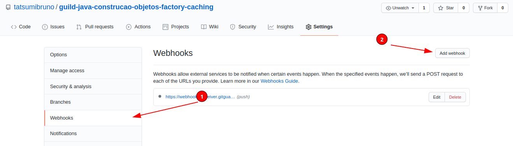
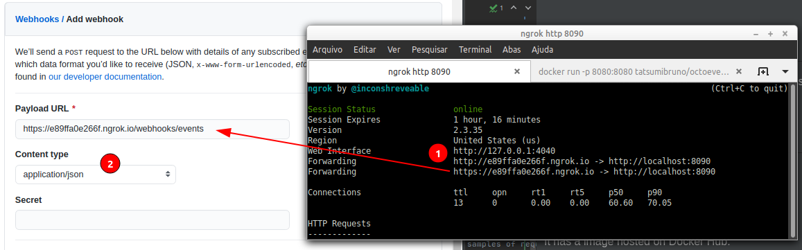
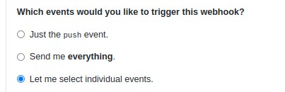
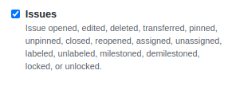
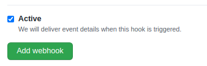
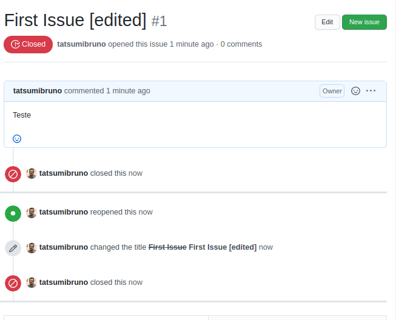
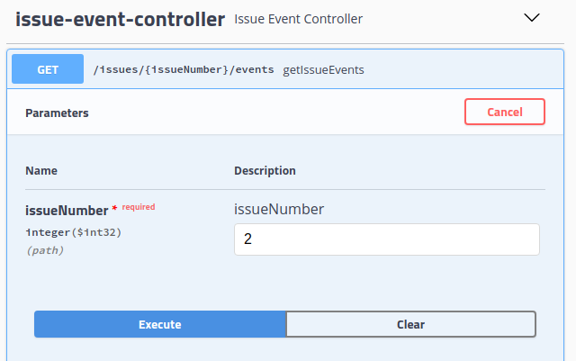
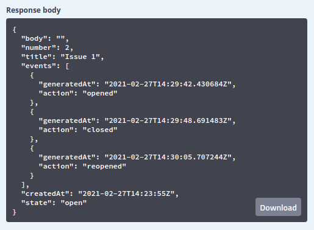

# Octo Events - API
API that listen to GitHub issue events from some repository

# How to run?
Here are some ways to run this app:

### In Docker
It has a image hosted on Docker Hub:
https://hub.docker.com/repository/docker/tatsumibruno/octoevents
```bash
docker run -p 8080:8080 tatsumibruno/octoevents:0.0.1
```

### Inside IDE
* Import maven project
* Configure JDK 11
* Right-click on `Application` class and Run/Debug.

### CLI
*You gonna need Java 11 and Maven
<br>
<br>
<b>With terminal inside project folder, follow this steps:</b>
<br>
Compile fat jar file:
```bash
mvn package verify
```
Execute:
```bash
java -jar /target/octoevents-api-0.0.1-SNAPSHOT.jar
```

# Configuring GitHub webhook with the API
Configure [ngrok](https://ngrok.com/docs) to forward your http port:
```bash
ngrok http 8080
```
Access your repository webhook settings:



Set your exposed URL and modify Content-Type to application/json:



Configure to listen just the issue events (and clear the others):





Add Webhook



# Testing API
Create some issue and modify its state (e.g Edit, Close, Reopen)



Access http://localhost:8080/swagger-ui.html and execute the endpoint to get the events from created issue:




